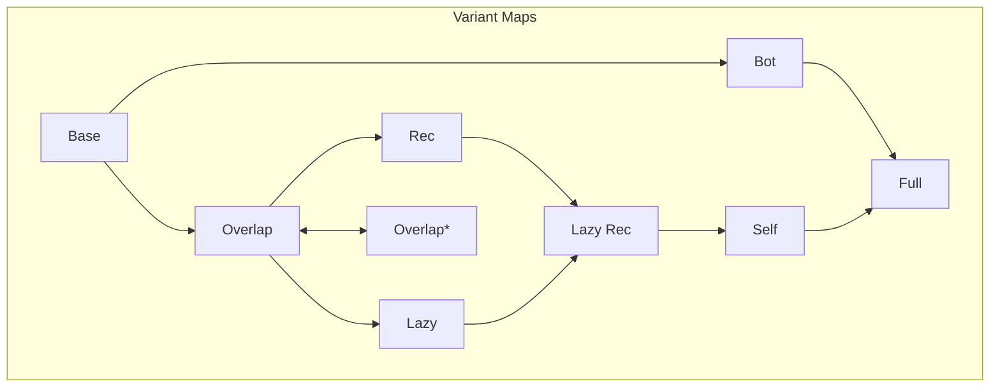

# Reachability Types

## Overview

The $λ^*$-calculus [1] and its variations, gradually increasing in complexity.

* [`Base`](lambda_star_base) -- Type soundness proof in Coq of the simplest system, lacking recursion, function self qualifiers, and a bottom qualifier. Mutable references are restricted to values of a base type. Functions and arguments may not overlap. Qualifiers are represented by a [set data type](https://coq.inria.fr/distrib/current/stdlib/Coq.FSets.FSetInterface.html).
* [`Bot`](lambda_star_bot) -- Extends the base version with a bottom qualifier for untracked values, which, e.g., enables polymorphic mutable references.
* [`Overlap`](lambda_star_overlap) -- Extends the base version to support overlap between functions and arguments at call sites.
Term typing "eagerly" assigns transitively closed qualifiers.
* [`Rec`](lambda_star_overlap_rec) -- Adds recursive lambda abstractions to the overlap system.
* [`Lazy`](lambda_star_overlap_lazy) -- "Lazy" version of the overlap system, where term typing assigns _minimal_ qualifiers and uses
transitive closures "lazily" on demand.
* [`Lazy_Rec`](lambda_star_overlap_lazy_rec) -- Adds recursive lambda abstractions to the lazy overlap system.
* [`Self`](lambda_star_overlap_lazy_rec_self) -- Adds function self qualifiers, permitting escaping closures.
* [`Full`](lambda_star_full) -- Adds the bottom qualifier based on `Self`.

The following variants use the new propositional set implementation:
* [`Overlap`](lambda_star_overlap_prop_set) -- Overlap version with propositional implementation for sets.

For more information regarding the propositional set implementation, please check out [Overlap Prop Set](lambda_star_overlap_prop_set/README.md)

> Note: We have been experimenting with a propositional set implementation on some versions for more powerful automation.  The * versions in the diagram above indicate versions with propositional set implementation.

## References

[1] **Reachability Types: Tracking Aliasing and Separation in Higher-order Functional Programs** (OOPSLA 2021) 
by Yuyan Bao, Guannan Wei, Oliver Bračevac, Luke Jiang, Qiyang He, and Tiark Rompf
([pdf](https://dl.acm.org/doi/10.1145/3485516)).
