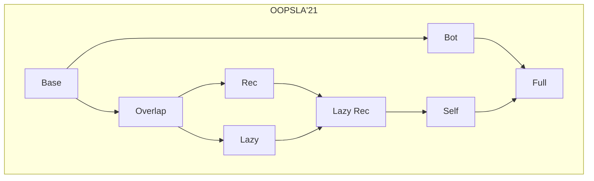

# Reachability Types

Mechanizations of the λ\*-calculus [1] and its variations, gradually increasing in complexity.

## Overview

* [`Base`](lambda_star_base) -- Type soundness proof in Coq of the simplest system, lacking recursion, function self qualifiers, and a bottom qualifier. Mutable references are restricted to values of a base type. Functions and arguments may not overlap. Qualifiers are represented by a [set data type](https://coq.inria.fr/distrib/current/stdlib/Coq.FSets.FSetInterface.html).
* [`Bot`](lambda_star_bot) -- Extends the base version with a bottom qualifier for untracked values, which, e.g., enables polymorphic mutable references.
* [`Overlap`](lambda_star_overlap) -- Extends the base version to support overlap between functions and arguments at call sites.
Term typing "eagerly" assigns transitively closed qualifiers.
* [`Rec`](lambda_star_overlap_rec) -- Adds recursive lambda abstractions to the overlap system.
* [`Lazy`](lambda_star_overlap_lazy) -- "Lazy" version of the overlap system, where term typing assigns _minimal_ qualifiers and uses
transitive closures "lazily" on demand.
* [`Lazy_Rec`](lambda_star_overlap_lazy_rec) -- Adds recursive lambda abstractions to the lazy overlap system.
* [`Self`](lambda_star_overlap_lazy_rec_self) -- Adds function self qualifiers, permitting escaping closures.
* [`Full`](lambda_star_full) -- Adds the bottom qualifier based on `Self`.

## Contributors

* [Oliver Bračevac](https://bracevac.org) (Mechanization lead)
* [Guannan Wei](https://continuation.passing.style)
* [Yuyan Bao](https://github.com/YuyanBao)
* [Siyuan He](https://sweetsinpackets.github.io)
* [Tiark Rompf](https://tiarkrompf.github.io)

## Acknowledgements

The mechanizations based on sets reuse some libraries by the [UPenn PL Club](https://www.cis.upenn.edu/~plclub/popl08-tutorial/code/index.html) that complement the FSet library shipping with [Coq](https://coq.inria.fr/distrib/current/stdlib/Coq.FSets.FSetInterface.html). We further
would like to thank [Boruch-Gruszecki et al.](https://arxiv.org/abs/2105.11896), whose artifact taught us how to set up the FSet library with extensional equality.

## References

[1] **Reachability Types: Tracking Aliasing and Separation in Higher-order Functional Programs** (OOPSLA 2021) 
by Yuyan Bao, Guannan Wei, Oliver Bračevac, Luke Jiang, Qiyang He, and Tiark Rompf
([pdf](https://dl.acm.org/doi/10.1145/3485516)).
