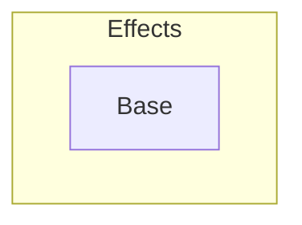

# Reachability Types and Effects

## Overview

The $λ^*_\varepsilon$-calculus [1] and variants, combining reachability with flow-(in)sensitive effects. More versions are forthcoming.

* [`Base`](lambda_star_effect_base) -- The base version of $\lambda^*$ with a simple flow-insensitive effect system.

## References

[1] **Reachability Types: Tracking Aliasing and Separation in Higher-order Functional Programs** (OOPSLA 2021) 
by Yuyan Bao, Guannan Wei, Oliver Bračevac, Luke Jiang, Qiyang He, and Tiark Rompf
([pdf](https://dl.acm.org/doi/10.1145/3485516)).