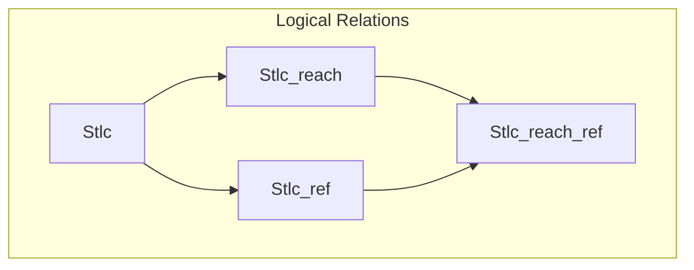

# Exploring Logical Relations for Reachability Types

## Overview

Logical relations for proving semantic type soundness of reachability types [1], gradually increasing in complexity. More version are forthcoming.

* [`Stlc`](stlc.v) -- Semantic type soundness proof of the simply typed lambda calculus.
* [`Stlc_reach`](stlc_reach.v) -- Extend the stlc version with reachability qualifiers.
* [`Stlc_ref`](stlc_ref.v)  -- Extend the stlc version with an immutable store.
* [`Stlc_reach_ref`](stlc_reach_ref.v) -- Extend the stlc version with an immutable store and reachability qualifiers. Add reachability predicate on terms/values, and prove semantic separation property.

## Compilation

To generate/update the `CoqMakefile` from `_CoqProject`:

`coq_makefile -f _CoqProject -o CoqMakefile`

Then, to compile/check all proof scripts listed in `_CoqProject`:

`make -f CoqMakefile all`

Compatibility tested with Coq `8.15.0`.

## References

[1] **Reachability Types: Tracking Aliasing and Separation in Higher-order Functional Programs** (OOPSLA 2021) 
by Yuyan Bao, Guannan Wei, Oliver Bračevac, Luke Jiang, Qiyang He, and Tiark Rompf
([pdf](https://dl.acm.org/doi/10.1145/3485516)).

