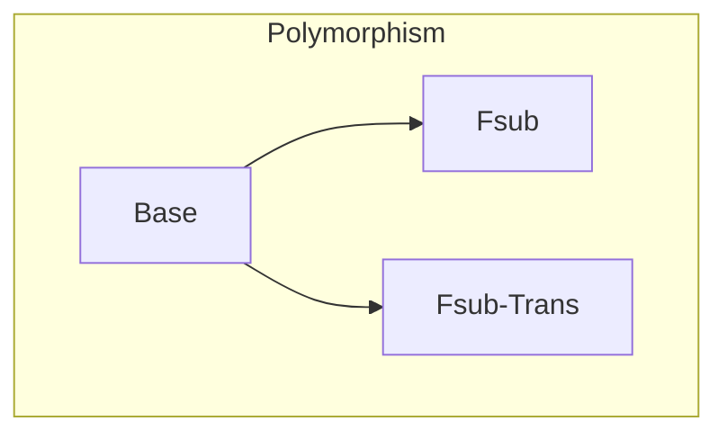

# Polymorphic Reachability Types

## Overview

The $λ^\diamond$-calculus [1], a refined reachability model that scales to parametric type polymorphism. More versions are forthcoming.

* [`Base`](lambda_diamond_base) -- Base system introducing the new reachability model, lacking type polymorphism.
* [`Fsub`](f_sub_diamond) -- Bounded type-and-reachability polymorphism.
* [`Fsub-Trans`](f_sub_trans) -- Bounded type-and-reachability polymorphism with explicit transitive closure.

[`Fsub-Trans`](f_sub_trans) should be considered as the reference mechanization of the $F_{<:}^\diamond$-calculus from POPL '24.

## References

[1] **Polymorphic Reachability Types: Tracking Aliasing and Separation in Higher-order Generic Programs** (POPL 2024) 
Guannan Wei, Oliver Bračevac, Siyuan He, Yuyan Bao, and Tiark Rompf
([pdf](https://www.cs.purdue.edu/homes/rompf/papers/wei-popl24.pdf)).
